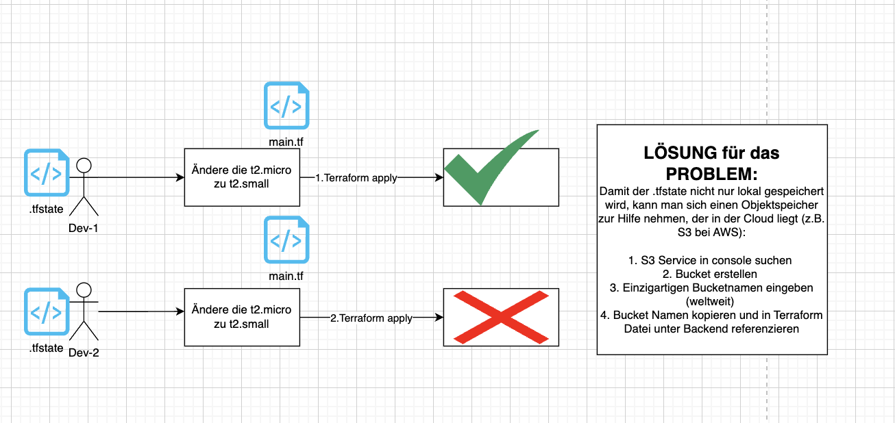
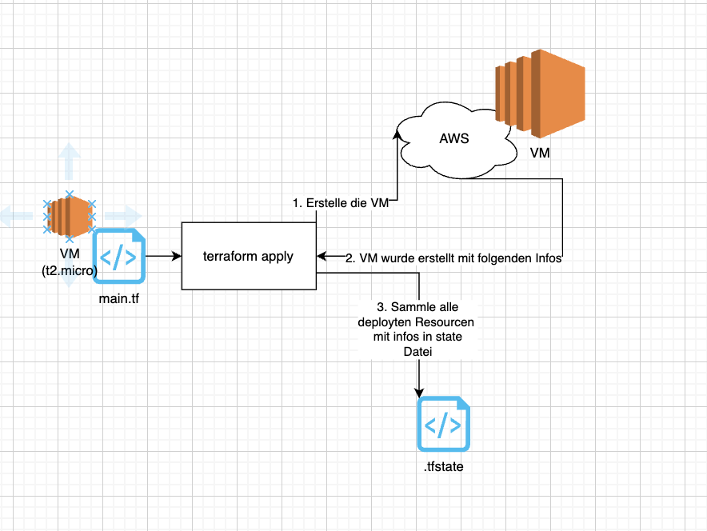

## 1. Umgebungsvariablen setzen

- Die Umgebuzngsvariablen sind Teil der Session im Terminal/Powershell
- Im AWS Kontext nutzen wir die Env-Variablen, um unseren `AWS_ACCESS_KEY_ID` und `AWS_SECRET_ACCESS_KEY` zu setzen

### Linux

`export AWS_ACCESS_KEY_ID=`

`export AWS_SECRET_ACCESS_KEY=`

`export AWS_DEFAULT_REGION=us-east-1`

### Windows

`$env:AWS_ACCESS_KEY_ID=""`
`$env:AWS_SECRET_ACCESS_KEY=""`
`$env:AWS_DEFAULT_REGION="us-east-1"`

## Terraform state

### Workflow

### TF State Remote in Speicher ablegen

## Aufgabe Git Branches

1. `git pull` von main branch, um aktuelle Änderungen herunterzuladen
2. Neuen Branch erstellen `feature/003-update-infrastructure`
3. Infrastructure.md anlegen
4. `commit` auf Änderung
5. Branch publishen
6. Pull request über Github.com UI erstellen
7. Einen Kommentar bei einer Änderung hinterlassen
8. Über Github UI mergen
9. `git checkout main`
10. `git pull` ausführen
